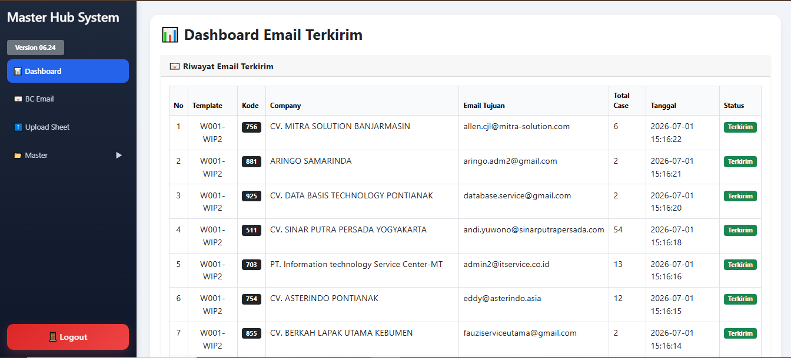
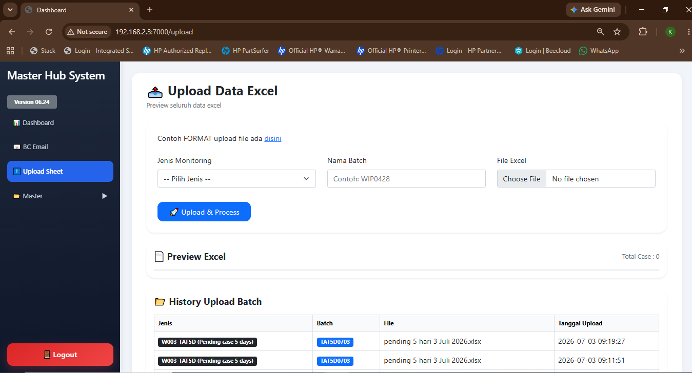

<div align="center">

# 📧 CRM EMAIL

### Sistem Monitoring & Pengiriman Email Otomatis untuk Partner

Upload data Excel • Kelola Data • Pilih Partner • Kirim Email Otomatis

---


</div>

---

# 🚀 Tentang Aplikasi

**CRM Email** merupakan aplikasi berbasis web yang digunakan untuk mengelola dan mengirim email monitoring kepada partner secara otomatis.

Pengguna cukup mengupload file Excel, kemudian sistem akan membaca data, mengelompokkan berdasarkan **Kode Company**, menyiapkan isi email sesuai template yang dipilih, dan mengirim email ke partner hanya dengan satu klik.

Aplikasi ini membantu mempercepat proses monitoring, mengurangi pekerjaan manual, serta memastikan pengiriman email menjadi lebih cepat, rapi, dan akurat.

---

# ✨ Fitur Utama

## 📂 Upload Excel

- Import data monitoring menggunakan file Excel
- Validasi format data
- Data otomatis tersimpan ke database

---

## 📊 Pengelolaan Data

- Menampilkan seluruh data monitoring
- Filter berdasarkan Company
- Filter berdasarkan Status
- Pencarian data
- Update informasi monitoring

---

## 🏢 Pengelompokan Partner

Sistem akan otomatis mengelompokkan data berdasarkan:

- Company Code
- Company Name
- Email Partner

Sehingga satu partner hanya menerima data miliknya.

---

## ✉️ Email Otomatis

Fitur email meliputi:

- Template Email
- Preview Email
- Attachment Excel
- Pengiriman berdasarkan Company
- Multiple Recipient
- CC & BCC
- Riwayat Pengiriman

---

## 📈 Monitoring

Beberapa monitoring yang tersedia:

- WIP
- Pending Case
- Pending Case > 5 Days
- Pending Case > 14 Days
- TAT Monitoring
- Finish Repair

---

# 🔄 Alur Penggunaan

```text
Upload Excel
      │
      ▼
Data Disimpan ke Database
      │
      ▼
Data Dikelompokkan Berdasarkan Company
      │
      ▼
Pilih Template Email
      │
      ▼
Preview Email
      │
      ▼
Klik Tombol SEND
      │
      ▼
Email Otomatis Terkirim ke Partner
```

---

# 🖥️ Teknologi

| Teknologi | Digunakan |
|-----------|-----------|
| Laravel | Backend |
| PHP | Programming |
| MySQL | Database |
| Bootstrap | User Interface |
| JavaScript | Frontend |
| SMTP Gmail / SMTP Server | Email Service |

---

# 📦 Instalasi

Clone project

```bash
git clone https://github.com/hostinghps-cloud/hps-smg.git
```

Masuk ke folder project

```bash
cd hps-smg
```

Install dependency

```bash
composer install
```

Copy file environment

```bash
copy .env.example .env
```

Generate key

```bash
php artisan key:generate
```

Migrasi database

```bash
php artisan migrate
```

Jalankan aplikasi

```bash
php artisan serve
```

---

# 📤 Cara Push ke GitHub

Tambahkan perubahan

```bash
git add .
```

Commit

```bash
git commit -m "Update Project"
```

Push

```bash
git push
```

---

# 📌 Struktur Proses Email

```text
Upload Excel
      │
      ▼
Database
      │
      ▼
Grouping Company
      │
      ▼
Template Email
      │
      ▼
Attachment Excel
      │
      ▼
SMTP Server
      │
      ▼
Partner
```

---

# 📷 Tampilan Sistem

Tambahkan screenshot aplikasi pada folder:

```
images/
```

Contoh:

```
images/dashboard.png

images/upload.png

images/email-preview.png

images/send-email.png
```

Lalu tampilkan di README:

```md
## Dashboard



## Upload Excel



## Email Preview


## Send Email


```

---

# 👨‍💻 Developer

**HostingHPS Cloud**

CRM Email Monitoring System

Laravel • PHP • MySQL • Bootstrap

---

<div align="center">

### ⭐ Jangan lupa berikan Star jika repository ini bermanfaat.

</div>
